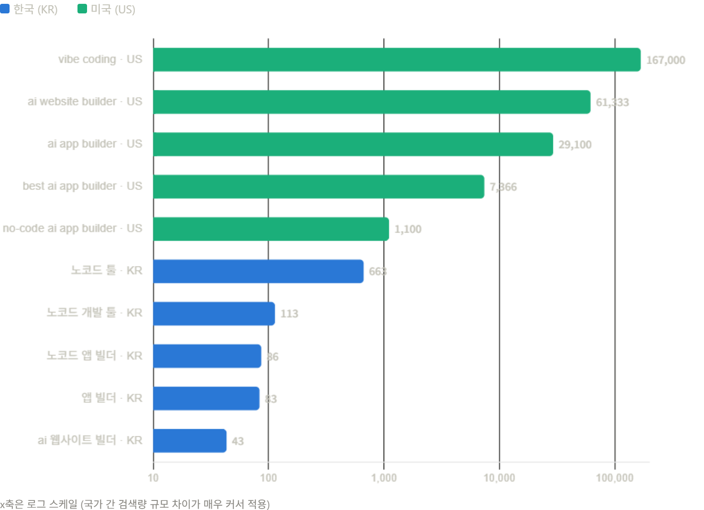
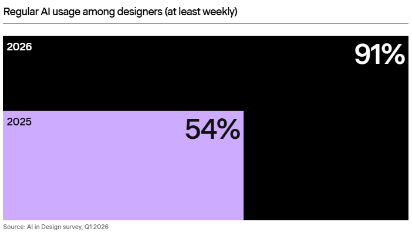

# 프로덕트 빌더. 정말로 필요한 직책일까?

최근 프로덕트 빌더라는 포지션 공고가 종종 보이는 것 같습니다.   
이 직책은 LLM의 발전으로 코딩과 디자인 작업의 속도가 향상되며, 이를 일괄적으로 처리할 수 있는 role을 처리하는 것으로 보입니다.

## 데이터로 본 프로덕트 빌더

출처: 리스닝마인드 / 2026년 3월~5월 평균 검색량

실제 한국 검색 데이터로는 아직 많은 사람이 정확히 이 키워드로 탐색하고 있지는 않아요.   
하지만 미국에서는 1천 건 이상의 월 평균 검색 데이터가 나타나고 있습니다. 확실히 관심도가 상당한 것으로 보여지는 듯합니다. ai app builder 같은 키워드가 눈에 띄네요.  

출처: https://stateofaidesign.com/chapters/tools

해당 사이트에서의 지표를 보면 이미 2026년에는 91%에 달하는 디자이너들이 AI를 정기적으로 사용한다고 하고 있습니다. 실제로 저희 서비스의 경우도 클로드 코드로 많은 디자인을 처리하고 있는데요. 이러한 시장의 변화가 더욱 실감이 나는 최근인 것 같습니다.

## 저는 써보니까, 완벽하진 않지만 도움이 된다고 생각해요.

실제로 최근 저의 경우도 피그마는 지금 일차적인 시안을 만들어내고 그것을 바로 VIBE 코딩으로 프로토타이핑하여서 사용성을 확인해 보거나 일차적인 기획과 안을 클로드에게 전달하여 그것을 기반으로 2안과 3안을 받아볼 수 있습니다. 물론 이것을 받아본다고 바로 사용하기는 어렵고, 서비스의 톤과 방향 먼저 확인하고 그것을 참고하여 사용할 수 있는 것을 사용하고 좀 더 정제해 나가는 작업이 필요합니다.

## 그렇다면 프로덕트 빌더라는 포지션은 정말로 유효할 것인가?

물론 기존에 프로덕트의 개발 과정이었던 기획을 하고 디자인을 하여 이것을 개발자에게 전달하고 그것을 개발자가 시작 화면을 구현하고 백단의 작업을 처리하는 과정, 이 자체는 분명히 줄었을 수 있으나 그럼, 여기서 몇 가지 필요한 것들이 있습니다. 첫 번째로는 자신이 가진 전문적인 분야에 대해서는 충분히 검증하고 필터링하는 과정을 거칠 수 있습니다. 하지만 그 외의 분야에 대해서는 어떤 것이 좋은 코드이며 좋은 사용자를 가진 디자인이냐. 이것에 대해서는 검증하는 과정이 다소 복잡할 수 있다고 생각합니다. 사실 우리 팀의 경우는 AI가 본격적으로 사용되기 이전부터 디자이너가 직접 퍼블리싱을 하고 그것을 깃의 커밋하는 그러한 과정을 거쳐 왔는데요.

이러한 기본적인 과정을 직접 겪어본 사람은 이것이 서비스 내에서 적절하게 사용되고 있는 구조인가를 저는 쉽게 이해할 수 있을 것입니다. 저 또한 그랬고요. 하지만 프론트가 구동되는 수많은 프레임워크나 언어 등을 별도로 학습하고 이것을 보는 것은 아니기 때문입니다. 그런 스타일 관련된 코드에서는 충분히 확인할 수 있겠으나 그 이후에 리뷰하는 과정에서는 어려움이 있을 것으로 여겨집니다. 어쩌면 많은 기업도 이런 것에 대해서 이해하고 해당 채용 공고를 제시하고 있는 것일까? 어쩌면 이것에 대해서는 다소 미지수일 수 있습니다.

## 결론: 직책은 잠깐 불어온 바람일 수 있다. 하지만 역량은 필요하다.

확실한 것은 이전보다 분명 만드는 것이 훨씬 쉬워진 시대가 되었습니다. 이전에 많이 이야기되던 T자형 인재들이 빛을 발할 수 있는 시대가 된 것 같아요. 본인의 전문 분야를 기반으로 다른 분야에 대해서도 조금씩 이해를 하고 그것을 직접 실행해 볼 수 있는 시대입니다. 하지만 그럼에도 서비스를 낸다는 것은 누군가는 이것을 사용해야 한다는 것이고 AI 가 내 전문 분야 외에 다른 것을 한다고 해도 그것을 한순간에 장난감으로 끝낼 것이냐. 그것은 아닐 거라고 생각합니다.

빌더로서 모든 과정을 혼자 총괄하며, 한 달에 10개 서비스를 만든다고 해도 아무도 사용하지 않을 수 있다는 거죠. 저는 만들 수 있으니까 만드는 것이 아닌 필요해서 만들어야 한다는 것을 요즘 느끼고 있습니다. 다른 분들은 어떠신가요?
